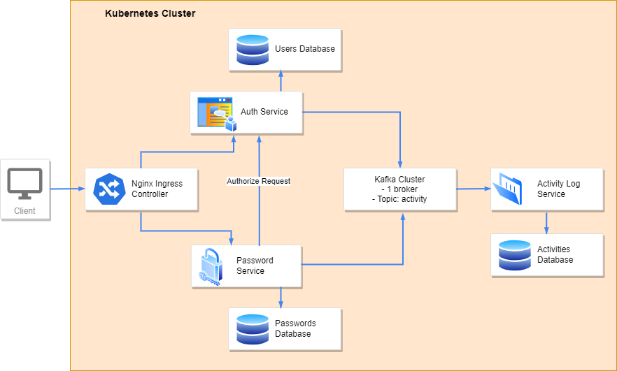

# SecureLockr
A password manager application built using microservices

## Architecture

## Language
Go

## Technologies
PostgreSQL, Docker, Kubernetes, Nginx Ingress Controller, Kafka

## Microservices
Auth Service: Handles signups, logins, and JWT validation. Asynchronously sends an account activity log message to Kafka broker when a user logs in

Password Service: Handles adding, deleting, updating, and fetching of passwords. Asynchronously sends an account activity log message to Kafka broker for each action

Activity Log Service: Retrieves account activity log messages from Kafka broker and stores it in a database

